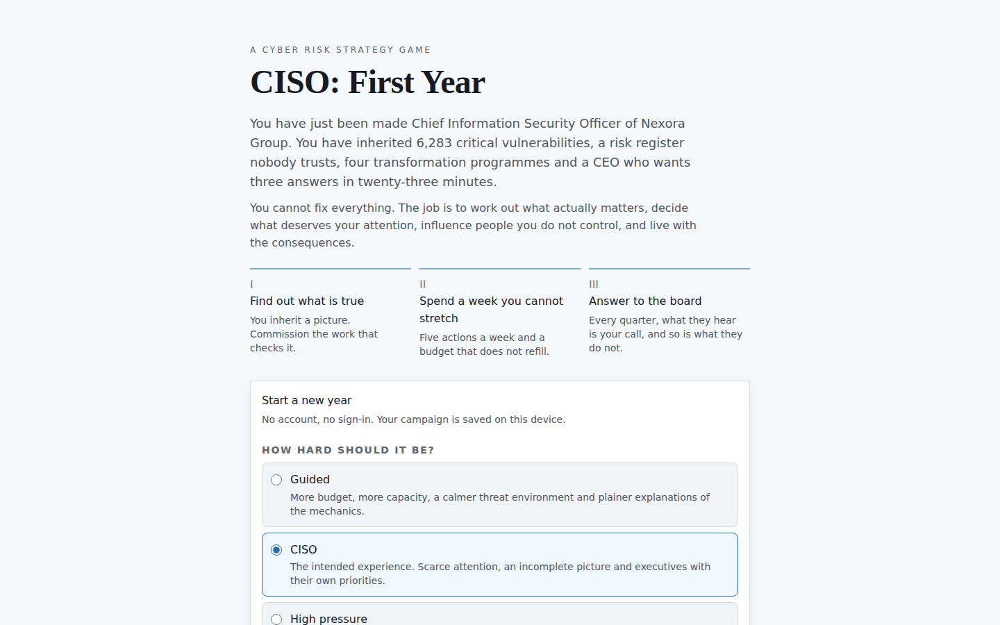
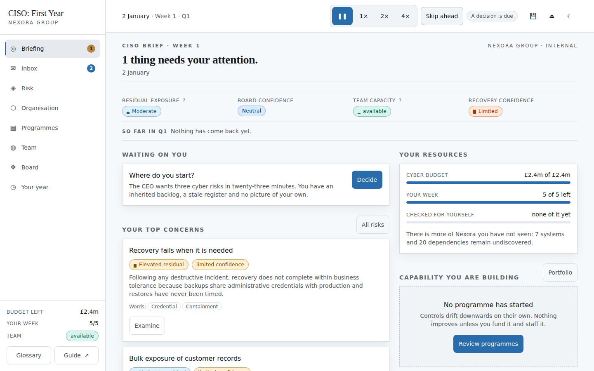
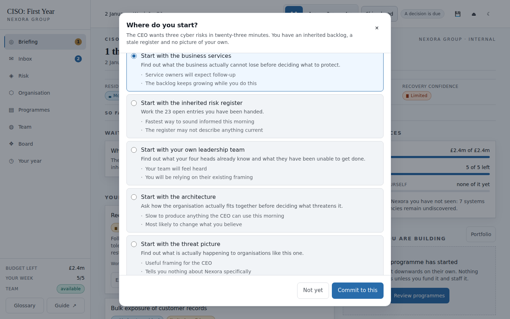
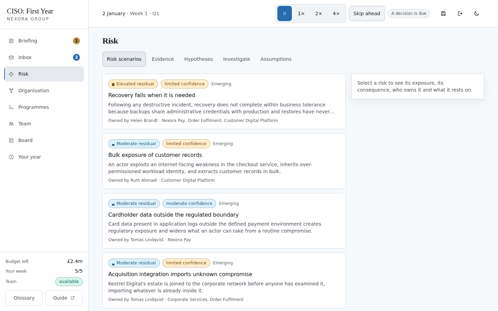
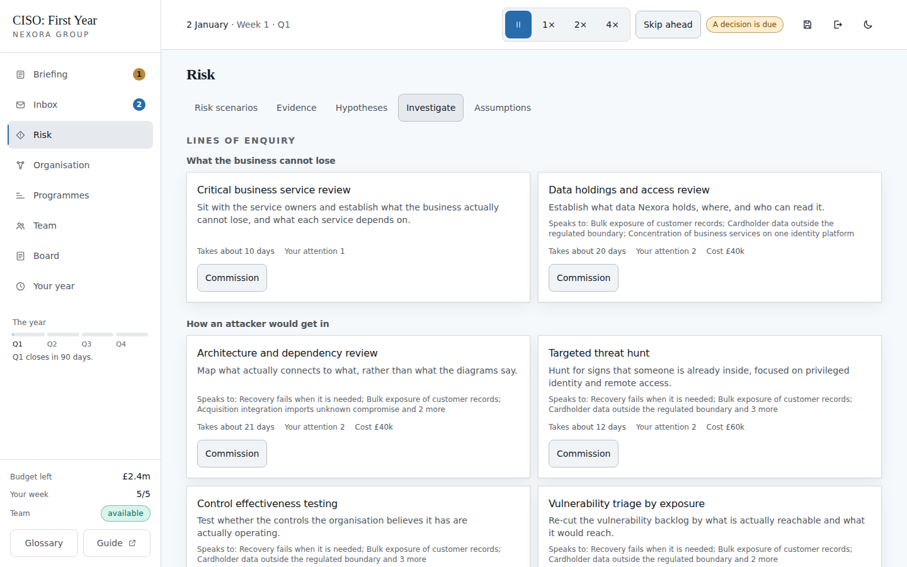
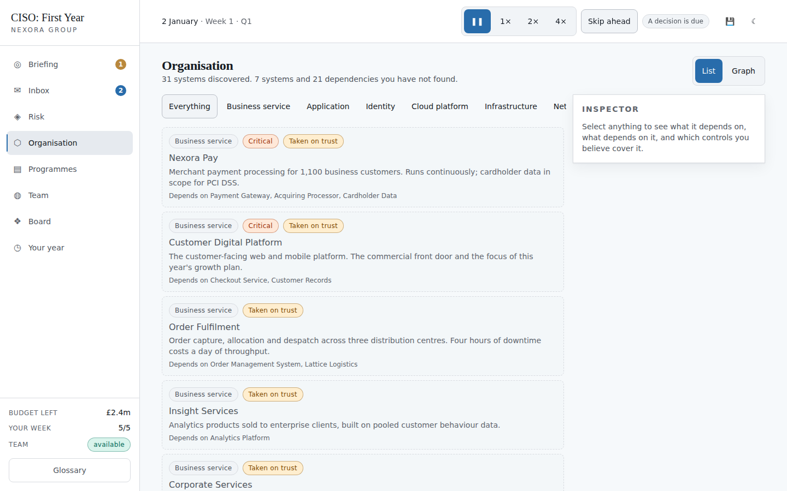
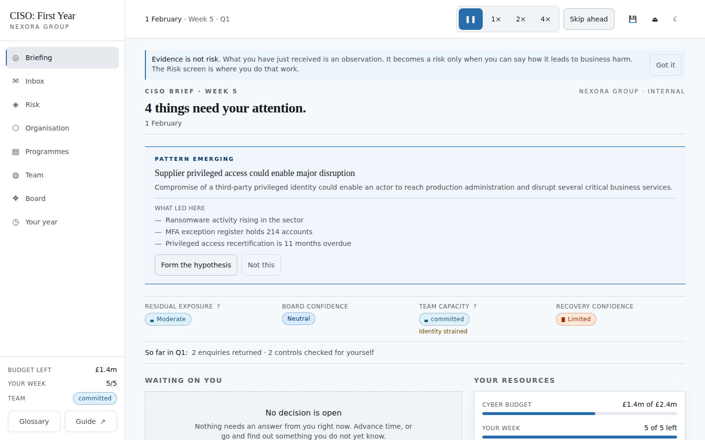
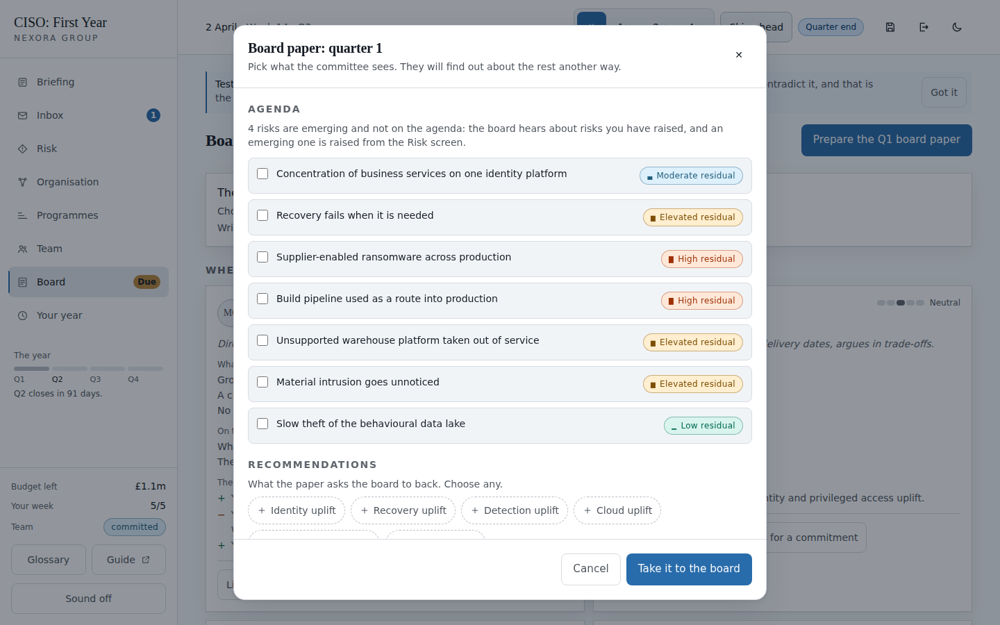
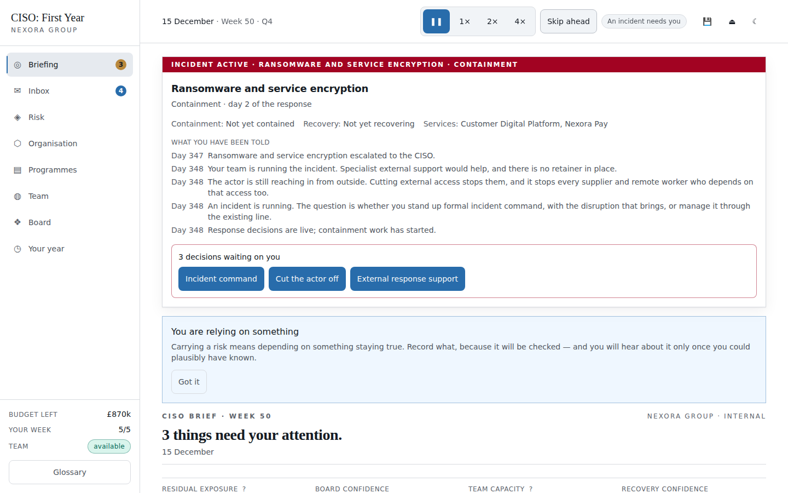
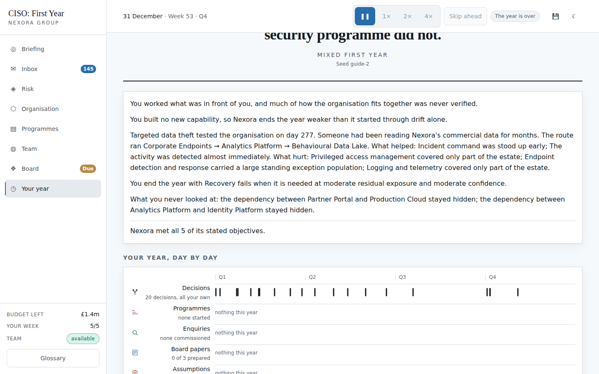

# CISO: First Year — a player's guide

You have just been made Chief Information Security Officer of Nexora Group: a
mid-sized digital services company with 4,500 people, a payments business, a
cloud-heavy platform and a legacy estate nobody has counted.

You play one year, from 2 January to 31 December. There is no combat, no score
and nothing to click quickly. The whole game is **deciding what deserves your
attention when you cannot possibly cover everything**, and then living with what
you chose.

Play it at **<https://ciso-risk-game.vercel.app>** — no account, nothing to
install.

This guide assumes you have never played and know nothing about the subject. It
takes about ten minutes to read, and you do not need it to start — the game
teaches itself as you go — but it will save you the first hour of confusion.

---

## The one rule worth knowing before you start

**You cannot fix everything, and the game will not let you try.**

You inherit 6,283 critical vulnerabilities, 23 open risk entries, five vacancies
and four transformation programmes already in flight. Your budget covers roughly
two of the six things worth building. Your week covers about five meaningful
actions.

So the question is never *"is this bad?"* — almost everything is bad. The
question is *"is this the thing I spend this week on?"*

A year where you tried to do everything goes worse than a year where you chose
three things and did them.

---

## Starting

Pick a difficulty and press **Begin your first day**. If you are new, the
differences that matter are:

| | What changes |
|---|---|
| **Guided** | More money, more people, an extra action each week, and you inherit a clearer picture of the organisation. The full game, with room to breathe. |
| **CISO** | The intended experience. Scarce attention, an incomplete picture, executives with their own priorities. |
| **High pressure** | A harsher world more than a weaker you. Noticeably more threat activity, far less of the organisation documented before you arrived, and executives with less patience. Your budget and team are only slightly tighter. |

Start on **CISO** unless you would rather learn the systems first — the modes
differ in how the year turns out, not in what you are allowed to do. *Replay
settings* holds a campaign seed; ignore it. It exists so two people can play the
same world.

The game saves constantly to your own browser. There is no account and nothing
is sent anywhere.

---

## The Briefing: your home screen

This is where every day starts. Five things are worth finding:

**The four bands across the top.** Residual exposure, board confidence, team
capacity and recovery confidence. They are words — *Moderate*, *Neutral*,
*Limited* — never numbers. That is deliberate: a real CISO argues from judgement,
not from a score, and a number would invite you to optimise it. The `?` opens a
plain-language explanation.

**Waiting on you.** Anything that needs an answer. Ignore it long enough and the
organisation decides without you, which is recorded and counts against you at
the end of the year.

**Your top concerns.** The risks you have actually assessed, worst first.

**Your resources** (right). Three bars:
- **Cyber budget** — money for the year. It does not refill.
- **Your week** — five actions, refreshed every Monday. Unused ones do *not*
  carry over.
- **Checked for yourself** — how much of Nexora you have personally verified. On
  day one this reads *none of it yet*, and it is the single most honest number on
  the screen. You inherited a picture; you have not confirmed any of it.

**The clock** (top). `1× 2× 4×` run time forward; **Skip ahead** jumps to the
next thing that needs you, which is how most people play. Time pauses by itself
whenever something important happens.

---

## Spending your week

Everything meaningful costs **attention**, and you have five per week:

| Action | Costs |
|---|---|
| Commission an investigation | 1 or 2, shown on the card |
| Press an executive for something | 1 |
| Escalate a risk to an executive | 1 |
| Form a hypothesis from a pattern | 1 |
| Turn a hypothesis into a formal risk | 2 |
| Start or intervene in a programme | 2 |
| Prepare the quarterly board paper | 2 |

Deeper work costs more: a privileged access review is 1, an architecture and
dependency review or a recovery test is 2. Each card tells you before you
commit, along with how long it takes and what it costs in money.

Answering a decision is free. Reading is free. Thinking is free. **Acting** is
what costs.

If a button is greyed out with *"No attention left this week"*, that is not a
bug — come back on Monday, or spend the week on something else.

---

## Decisions

Decisions are the spine of the game. Each gives you a situation, several real
options, and — importantly — **what each option will visibly cost you**. There
is usually no correct answer. The first decision of the game says so outright:
*"There is no mechanically superior answer here."*

Two things to understand:

**The deadline is real.** A decision left unanswered lapses, and the organisation
does whatever it would have done anyway. That is a worse outcome than choosing
badly, and the annual review names it.

**Record why.** Below the options is a *Why?* panel with reasons like *"The
consequence is material"* or *"Compensating controls are sufficient"*. On serious
decisions this is mandatory and the button reads **Record why first** until you
pick one.

This is not paperwork. At the end of the year the game takes every reason you
gave, checks it against what actually happened, and tells you which of your
justifications the year contradicted. It is the part of the debrief most players
find uncomfortable, and it only works if you answer honestly rather than picking
whatever sounds best.

---

## Finding out what is actually true

The **Risk** screen is where understanding gets built, across five tabs:

- **Risk scenarios** — proper risk statements: threat, pathway and business
  consequence together. *"Unpatched server"* is not a scenario; *"an actor
  reaches fulfilment through an unpatched server"* is.
- **Evidence** — observations you have collected. An alert, a test result,
  something somebody told you. **Evidence is not risk until you interpret it**,
  and some of it is deliberately misleading.
- **Hypotheses** — propositions you are testing. Meant to be tested, not
  defended.
- **Investigate** — commissioning work.
- **Assumptions** — things your past decisions depend on being true.

### Commissioning work

Each line of enquiry shows how long it takes, what it costs and which of your
four leaders you are giving it to. **Who you choose matters**: their expertise,
their current workload and their morale all shape what comes back. Overload
someone and you get a thin answer, late — and a thin answer is not a clean bill
of health.

This is the main way the *Checked for yourself* bar moves, and it is the thing
new players most often skip. Do not skip it.

### The organisation

Every system, supplier, network and data set, and what depends on what. Use
**List** rather than **Graph** at first — it is far easier to read.

Notice the **Taken on trust** badges. Those are things you know exist because
you were told, not because anyone checked. The difference between *seen* and
*verified* is the game's central idea, and the annual review scores it.

---

## When the game notices something

Sometimes the evidence you are holding adds up to something. When it does, the
game says so: **"You may have found a pattern"**, with the proposition and the
evidence behind it.

It stops there deliberately. Forming the hypothesis costs attention, and **"Not
this"** is a real answer that sticks. The game will point out what it noticed; it
will not do your thinking for you.

These offers are rare — roughly one day in fifty — and they expire as the
evidence goes stale. If one looks right, take it.

---

## The board, every quarter

Three times a year — at the end of Q1, Q2 and Q3 — the board risk committee
wants a paper, and the Briefing tells you when one is due. You choose **what the
committee sees**.

The rule the game enforces: *surprising the board with something you already knew
is the classic failure*. Leave a material item off and they find out another way,
and your standing drops. Bring twenty things and the chair asks you for fewer,
sharper items.

There is also a checkbox — **"Be explicit about what you do not yet know"**.
Tick it. Honest uncertainty, communicated well, builds more credibility than
confidence you cannot support. That is true in the game and it is true in the
job.

The pack in the picture above is empty, which is what an early one looks like
if you have not yet assessed a risk, had an assumption fail or run an incident.
The game does not pretend otherwise — it says so, and points out that having
nothing to report is itself something the board may ask about. Raise a risk or
two and the same dialog fills with items to choose between.

---

## When it goes wrong

Some years have an incident; some do not. When one starts, a red **Incident
active** bar sits above every screen until it closes, showing what you have been
told, what you have already decided, and what is waiting on you.

You will be asked things like whether to stand up formal incident command
(faster containment, business-wide disruption), and whether to notify the
regulator early on incomplete facts or wait until you know more. There is no
safe answer. Both have consequences, and both are remembered.

Note what the bar shows — *containment*, *recovery*, *affected services* — and
what it does not: the attack path. You only ever see what your own people have
actually told you.

---

## How the year is judged

On 31 December you get an annual review. It is not a score. It is eight
dimensions, each with a band and a sentence explaining it:

| Dimension | What it asks |
|---|---|
| Risk understanding | Did you build a picture, or work someone else's? |
| Prioritisation | Did your budget and attention go to what mattered most? |
| Resilience | When tested, what did it cost? |
| Cyber programme execution | Did you finish what you started? |
| Business enablement | Did the business get its year? |
| Communication and escalation | Did the board come to rely on you? |
| Team sustainability | Can your people do this again? |
| Material blind spots | What did you never look at? |

Plus a narrative, and the section that reckons with every reason you recorded.

There is no winning. A good first year is one where the trade-offs you made were
the ones you would defend — and the review is designed to show you where they
were not.

---

## A first year that works

If you want a plan for your first playthrough:

1. **Start with the business services.** Find out what Nexora cannot afford to
   lose before deciding what to protect.
2. **Be honest with the CEO** in the first week. You have had one morning; say
   so. It costs you nothing you will miss and buys credibility you will need.
3. **Commission two or three investigations early**, one at a time, to different
   leaders. Privileged access and suppliers are usually where the real problem
   is.
4. **Pick one programme and finish it.** Two if the budget stretches. Starting
   four and finishing none is a worse year than starting one and completing it.
   Which one you pick is scored: the review asks whether your budget and
   attention went to the largest risks you inherited, and answering every
   decision promptly is not a substitute for having aimed at something.
5. **Do all three board papers.** They cost 2 attention each and they are how
   the board comes to trust you. Skipping them is the most common way an
   otherwise good year scores badly.
6. **Leave something in reserve.** An incident in October is much worse if you
   spent the last of the budget in September.

## Common mistakes

- **Answering everything and investigating nothing.** You will finish the year
  with `weak` risk understanding and a review that says you spent the year acting
  on a picture you never verified. It is the most common first playthrough.
- **Commissioning everything at once.** Your team has limits. Over-commit and
  the work comes back thin and late, and morale does not recover quickly.
- **Treating volume as risk.** 6,283 vulnerabilities is a number designed to
  frighten you. 1,900 of them are on isolated development machines. Some of the
  loudest findings in the game are deliberately irrelevant.
- **Blocking the business on principle.** Security friction costs the company its
  objectives, and that is scored too. *Support, with conditions* is usually
  available and usually better than refusal.
- **Ignoring your team.** Burning out a function is invisible until the annual
  review tells you the year was delivered on people who cannot do it again.

## Keyboard shortcuts

| Key | Does |
|---|---|
| `Space` | Pause or resume time |
| `→` | Advance to the next meaningful event |
| `H` `I` `R` `O` `P` `T` `B` | Briefing, Inbox, Risk, Organisation, Programmes, Team, Board |
| `Y` | Your year — the timeline of what you have done so far |
| `G` | Glossary |
| `Esc` | Close a dialog |

The **Glossary** (bottom left, or `G`) defines every term the game uses, in
plain language. It is worth a look the first time a phrase like *residual
exposure* or *dwell time* appears.

---

*Screens in this guide are generated from the running game by `pnpm guide:shots`
and may differ slightly from your campaign — the organisation's hidden
configuration varies with the seed.*
