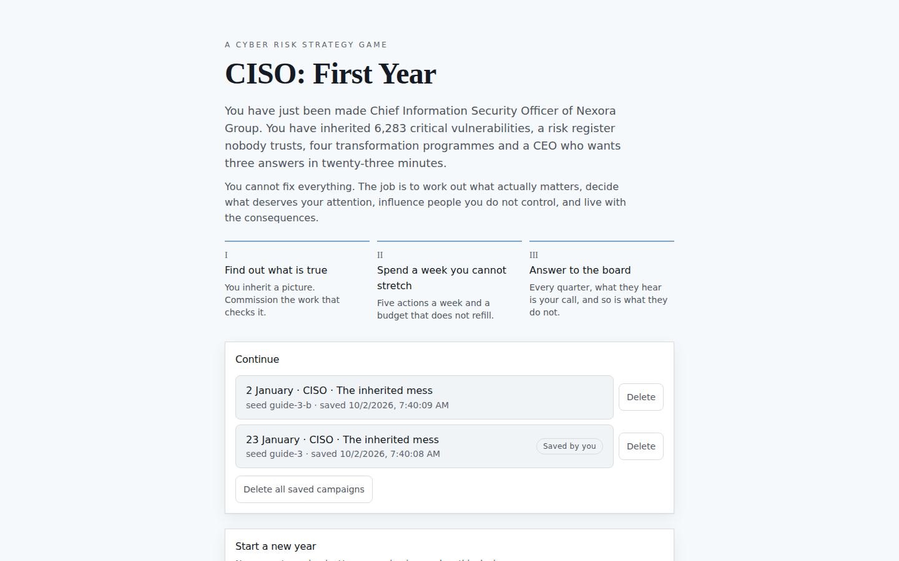

# CISO: First Year — a player's guide

You have just been made Chief Information Security Officer of Nexora Group: a
mid-sized digital services company with 4,500 people, a payments business, a
cloud-heavy platform and a legacy estate nobody has counted.

You play one year, from 2 January to 31 December. There is no combat, no score
and nothing to click quickly. The whole game is **deciding what deserves your
attention when you cannot possibly cover everything**, and then living with what
you chose.

Play it at **<https://ciso-risk-game.vercel.app>** — no account, nothing to
install.

This guide assumes you have never played and know nothing about the subject. It
takes about ten minutes to read, and you do not need it to start — the game
teaches itself as you go — but it will save you the first hour of confusion.

---

## The one rule worth knowing before you start

**You cannot fix everything, and the game will not let you try.**

You inherit 6,283 critical vulnerabilities, 23 open risk entries, five vacancies
and four transformation programmes already in flight. Your budget covers roughly
two of the six things worth building. Your week covers about five meaningful
actions.

So the question is never *"is this bad?"* — almost everything is bad. The
question is *"is this the thing I spend this week on?"*

A year where you tried to do everything goes worse than a year where you chose
three things and did them.

---

## Starting

Pick a difficulty and press **Begin your first day**. If you are new, the
differences that matter are:

| | What changes |
|---|---|
| **Guided** | More money, more people, an extra action each week, and you inherit a clearer picture of the organisation. The full game, with room to breathe. |
| **CISO** | The intended experience. Scarce attention, an incomplete picture, executives with their own priorities. |
| **High pressure** | A harsher world more than a weaker you. Noticeably more threat activity, far less of the organisation documented before you arrived, and executives with less patience. Your budget and team are only slightly tighter. |

Then pick **what you are walking into**. The company is always Nexora; the
year it has had before you arrive is not:

| | The year begins with |
|---|---|
| **The inherited mess** | The usual opening, and the one to start with. |
| **After the breach** | Emergency money, a board that has stopped trusting reassurance, and attackers who know the way back in. |
| **New money, short patience** | A much bigger budget, and a finance director and an operation that want to see it land quickly. |
| **A tidy inheritance** | Better controls than most, a smaller budget, and a board that thinks the job is done. |
| **Surprise me** | One of the four, drawn from the seed. You find out on your first morning. |

Each situation also brings one decision the others never see, and the replies
to it arrive later in the year. The annual review answers the question your situation started with: whether
the breach happened again, what the money bought, or how much of your
predecessor's good work you actually checked.

Start on **CISO** unless you would rather learn the systems first — the modes
differ in how the year turns out, not in what you are allowed to do. *Replay
settings* holds a campaign seed; ignore it. It exists so two people can play the
same world.

The game saves constantly to your own browser. There is no account and nothing
is sent anywhere. The **⏏** beside the save button at the top saves and closes
the campaign you are in, back to this screen.

Come back later and a **Continue** list sits above that. Each campaign is one
save, kept at the day you last reached, so there is one row per year you have
played, newest first. Pick one to carry on. Each has a **Delete** beside it,
and once you have more than one campaign there is a control to delete them all.
Both ask before they do it, because there is no undo. To keep a copy, open
the campaign and use **Export this campaign** on **Your year**, at any point in
the year; the file comes back through **Import a saved campaign**. If a save is
ever damaged, the game opens the campaign from the save before it and says so.

---

## The Briefing: your home screen

This is where every day starts, and it is written as a brief rather than a
dashboard. Seven things are worth finding:

**The masthead and the headline.** `CISO BRIEF · WEEK 1` at the top, and under
it a single line counting what wants you today — *"Two things need your
attention."* If it says nothing is waiting, nothing is: you can run the clock.

**Waiting on you.** Anything that needs an answer, immediately under the
headline. Ignore it long enough and the organisation decides without you, which
is recorded and counts against you at the end of the year.

**The four standing readings**, in a strip below the headline: residual
exposure, board confidence, team capacity and recovery confidence. They are
words — *Moderate*, *Neutral*, *Limited* — never numbers. That is deliberate: a
real CISO argues from judgement, not from a score, and a number would invite you
to optimise it. They are deliberately quieter than the things above them,
because they are the state of the organisation rather than a list of things to
do. The `?` opens a plain-language explanation.

**The quarter so far.** One line under the readings, headed "So far in Q1" in the
first quarter, counts what the quarter
has produced: enquiries returned, programmes delivered, controls you checked
for yourself, risks improving. A quarter of work and a quarter of nothing look
different here long before the annual review says so.

**Came back to you.** What your own actions sent back and you have not read
yet: an enquiry that returned, a follow-up to a choice, a decision the
organisation took for you because you did not. It is the part of the inbox
that is about you; the rest of the inbox is about Nexora.

**Your top concerns.** The risks you have actually assessed, worst first. Each
one leads with the risk itself and carries its rating underneath — read the
sentence, not the colour.

**Your resources** (right). Three bars:
- **Cyber budget** — money for the year. It does not refill.
- **Your week** — five actions, refreshed every Monday. Unused ones do *not*
  carry over.
- **Checked for yourself** — how much of Nexora you have personally verified. On
  day one this reads *none of it yet*, and it is the single most honest number on
  the screen. You inherited a picture; you have not confirmed any of it.

**The clock** (top). `1× 2× 4×` run time forward; **Skip ahead** jumps to the
next thing that needs you, which is how most people play. Time pauses by itself
whenever something important happens.

---

## Spending your week

Everything meaningful costs **attention**, and you have five per week:

| Action | Costs |
|---|---|
| Commission an investigation | 1 or 2, shown on the card |
| Press an executive for something | 1 |
| Escalate a risk to an executive | 1 |
| Form a hypothesis from a pattern | 1 |
| Turn a hypothesis into a formal risk | 2 |
| Start or intervene in a programme | 2 |
| Prepare the quarterly board paper | 2 |

Deeper work costs more: a privileged access review is 1, an architecture and
dependency review or a recovery test is 2. Each card tells you before you
commit, along with how long it takes and what it costs in money.

Answering a decision is free. Reading is free. Thinking is free. **Acting** is
what costs.

If a button is greyed out with *"No attention left this week"* (on a
programme, *"Out of attention this week"*), that is not a bug — come back on
Monday, or spend the week on something else.

---

## Decisions

Decisions are the spine of the game. Each gives you a situation, several real
options, and — importantly — **what each option will visibly cost you**. There
is usually no correct answer. The first decision of the game puts it this way:
*"Each route buys you a different kind of understanding, and you cannot have all
of them first."*

Three things to understand:

**The deadline is real.** A decision left unanswered lapses, and the organisation
does whatever it would have done anyway. That is a worse outcome than choosing
badly, and the annual review names it.

**An option you cannot take says why.** It stays on the card with the reason
underneath: not enough budget, no attention left this week, or something the
year has not given you. Money taken *from* you is the exception — a cut is
never refused, it takes what is left, and the card says how much that is.

**Record why.** Below the options is a *Why?* panel with reasons like *"The
consequence is material"* or *"Compensating controls are sufficient"*. On serious
decisions this is mandatory and the button reads **Record why first** until you
pick one.

This is not paperwork. At the end of the year the game takes every reason you
gave, checks it against what actually happened, and tells you which of your
justifications the year contradicted. It is the part of the debrief most players
find uncomfortable, and it only works if you answer honestly rather than picking
whatever sounds best.

---

## Finding out what is actually true

The **Risk** screen is where understanding gets built, across five tabs:

- **Risk scenarios** — proper risk statements: threat, pathway and business
  consequence together. *"Unpatched server"* is not a scenario; *"an actor
  reaches fulfilment through an unpatched server"* is.
- **Evidence** — observations you have collected. An alert, a test result,
  something somebody told you. **Evidence is not risk until you interpret it**,
  and some of it is deliberately misleading.
- **Hypotheses** — propositions you are testing. Meant to be tested, not
  defended.
- **Investigate** — commissioning work.
- **Assumptions** — things your past decisions depend on being true.

Each scenario leads with two badges: its **residual** exposure — how bad it is
with the controls you have today — and how much **confidence** that reading
deserves. A severe risk you are unsure of and a moderate one you are sure of
call for different next steps: the first for looking, the second for acting.

After a risk has been watched for a fortnight it says which way it has moved
since it was first assessed. A green **Improving** means something you did is
landing; an amber **Worsening** means the world has moved and you have not. A
risk that has not moved says nothing, so the badges that do appear are the ones
worth reading. Expect most of an untended register to drift towards worsening:
controls decay on their own and the threat grows through the year.

A risk marked **Review due** is asking for a decision about it, not for more
reading. Open it and either accept it for a stated period, on assumptions you
record, or link it to the programme that treats it. The link button names the
programme, and appears once that programme has started; until then the risk
says which programme would treat it. Either answer sets the next review.

If a risk uses a word you do not know, the **Words** line under it lists the
terms it leans on; tap one and the glossary opens at the definition.

### Commissioning work

The enquiries are grouped by the question they answer — what the business
cannot lose, how an attacker would get in, identity and supplier access,
recovery and response, team and governance — and each says which of the risks
on your list it speaks to. Each line of enquiry shows how long it takes, what
it costs and which of your four leaders you are giving it to. **Who you choose matters**: their skill,
their current workload, their morale and how stretched the whole team is all
shape what comes back. The dialog says what to expect before you choose, and
why — *Has room for this*, or a reason such as *The team as a whole is
stretched* followed by *expect part of an answer* — and when work comes back
thin, it says why. A thin answer is not a clean bill
of health.

This is the main way the *Checked for yourself* bar moves, and it is the thing
new players most often skip. Do not skip it.

### The organisation

Every system, supplier, network and data set, and what depends on what. Use
**List** rather than **Graph** at first — it is far easier to read.

Notice which rows are **drawn with a dashed outline and set back**: those are
things you know exist because you were told, not because anyone checked. On
day one nearly the whole estate looks like that, and it resolves into solid
rows badged **Checked** as you verify things — the picture
visibly sharpens as the year goes on, which is the point. The difference between *seen* and
*verified* is the game's central idea, and the annual review scores it.

---

## When the game notices something

Sometimes the evidence you are holding adds up to something. When it does, the
game says so. **Pattern emerging** is ruled off from everything around it, with
the proposition set large and the evidence that led there listed underneath —
it is meant to read like an analyst's inference, not a notification.

It stops there deliberately. Forming the hypothesis costs attention, and **"Not
this"** is a real answer that sticks. The game will point out what it noticed; it
will not do your thinking for you.

An offer expires as the evidence behind it goes stale. If one looks right,
take it.

---

## The board, every quarter

Three times a year — at the end of Q1, Q2 and Q3 — the board risk committee
wants a paper, and the Briefing tells you when one is due. You choose **what the
committee sees**.

The rule the game enforces: *surprising the board with something you already knew
is the classic failure*. Leave a material item off and they find out another way,
and your standing drops. Pad it with items that are not material and the chair
names them and asks for fewer, sharper items. Material means a high residual
rating, a high consequence, or a risk you accepted on the organisation's
behalf; the Risk screen shows the first two. A paper can be written any time before the next quarter closes;
if it never is, the committee meets without one, the chair writes to say so, and
the board's standing on the Briefing drops. The board remembers a good paper for
about a season, so the standing you see in December is the one you earned in the
second half of the year.

There is also a checkbox — **"Be explicit about what you do not yet know"**.
Tick it. Honest uncertainty, communicated well, builds more credibility than
confidence you cannot support. That is true in the game and it is true in the
job.

The pack in the picture holds the four risks this player raised during the
quarter. The line above them counts the ones still *emerging*: the board hears
only about risks you have raised, and you raise an emerging one from the Risk
screen. An early pack can also be empty, if you have not yet assessed a risk,
had an assumption fail or run an incident. The game does not pretend otherwise
— it says so, and points out that having nothing to report is itself something
the board may ask about.

---

## When it goes wrong

Some years have an incident; some do not. When one starts, a red **Incident
active** bar sits above every screen until it closes, showing what you have been
told, what you have already decided, and what is waiting on you.

You will be asked things like whether to stand up formal incident command
(faster containment, business-wide disruption), and whether to notify the
regulator early on incomplete facts or wait until you know more. There is no
safe answer. Both have consequences, and both are remembered.

Note what the bar shows — *containment*, *recovery*, *affected services* — and
what it does not: the attack path. You only ever see what your own people have
actually told you.

---

## Watching your own year

Press `Y`, or pick **Your year** in the menu, for the whole campaign as one
364-day strip: the decisions you took and the ones that lapsed, programmes
running and finished, enquiries, board papers, assumptions that stopped holding,
and any incidents.

It is worth opening well before December. It is the quickest way to see whether
you have actually been doing anything — a year with one busy lane and five empty
ones is telling you something while there is still time to change it. **Read the
year as a list** underneath gives every mark with its date.

---

## How the year is judged

On 31 December you get an annual review. It is not a score. It is eight
dimensions, each with a band and a sentence explaining it:

| Dimension | What it asks |
|---|---|
| Risk understanding | Did you build a picture, or work someone else's? |
| Prioritisation | Did your budget and attention go to what mattered most? |
| Resilience | When tested, what did it cost? |
| Cyber programme execution | Did you finish what you started? |
| Business enablement | Did the business get its year? |
| Communication and escalation | Did the board come to rely on you? |
| Team sustainability | Can your people do this again? |
| Material blind spots | What did you never look at? |

Plus a narrative, and the section that reckons with every reason you recorded.
**Print or save as PDF** sets the review out as a document, on white and
without the game around it, if you want to keep it or show it to somebody.
**Share this year** sends the headline and the band on each dimension, with a
link that opens the same year — the same Nexora — for whoever receives it.

There is no winning. A good first year is one where the trade-offs you made were
the ones you would defend — and the review is designed to show you where they
were not.

At the foot of the review, the first button begins your second year, at the
same Nexora. Carried over:

- what you found;
- what you built;
- the people, and how they think of you;
- the risks you chose to carry, to the dates you gave them.

The budget is the one the autumn agreed. The executives remember what you
decided last year, and the board holds you to the priorities you gave it.
The review then compares the two years.

**Start another year** takes you back to the start screen instead, where the
finished year stays in the list. A fresh year is worth starting from a
different situation: each has its own budget, its own threat and a decision
the others never see.

---

## A first year that works

If you want a plan for your first playthrough:

1. **Start with the business services.** Find out what Nexora cannot afford to
   lose before deciding what to protect.
2. **Be honest with the CEO** in the first week. You have had one morning; say
   so. It costs you nothing you will miss and buys credibility you will need.
3. **Commission two or three investigations early**, one at a time, to different
   leaders. Privileged access and suppliers are usually where the real problem
   is.
4. **Pick one programme and finish it.** Two if the budget stretches. Starting
   four and finishing none is a worse year than starting one and completing it.
   Which one you pick is scored: the review asks whether your budget and
   attention went to the largest risks you inherited, and answering every
   decision promptly is not a substitute for having aimed at something.
5. **Do all three board papers.** They cost 2 attention each and they are how
   the board comes to trust you. Skipping them is the most common way an
   otherwise good year scores badly.
6. **Leave something in reserve.** An incident in October is much worse if you
   spent the last of the budget in September.

## Common mistakes

- **Answering everything and investigating nothing.** You will finish the year
  with `weak` risk understanding and a review that says you spent the year acting
  on a picture you never verified. It is the most common first playthrough.
- **Commissioning everything at once.** Your team has limits. Over-commit and
  the work comes back thin and late, and morale does not recover quickly.
- **Treating volume as risk.** 6,283 vulnerabilities is a number designed to
  frighten you. 1,900 of them are on isolated development machines. Some of the
  loudest findings in the game are deliberately irrelevant.
- **Blocking the business on principle.** Security friction costs the company its
  objectives, and that is scored too. *Support, with conditions* is usually
  available and usually better than refusal.
- **Ignoring your team.** Burning out a function is invisible until the annual
  review tells you the year was delivered on people who cannot do it again.

## Keyboard shortcuts

| Key | Does |
|---|---|
| `Space` | Pause or resume time |
| `→` | Advance to the next meaningful event |
| `H` `I` `R` `O` `P` `T` `B` | Briefing, Inbox, Risk, Organisation, Programmes, Team, Board |
| `Y` | Your year — the timeline of what you have done so far |
| `G` | Glossary |
| `Esc` | Close a dialog |

**Shortcut keys**, beside **Sound** at the bottom left (under **More** on a
phone), turns the single-key shortcuts off if they get in your way.

The **Glossary** (bottom left, or `G`) has two halves. The first defines the
words the game uses in its own way, such as *residual exposure* or *dwell
time*. The second defines the words the field uses that the game borrows,
such as *privileged access*, *segmentation*, *MFA* or *break-glass* — two
sentences each, what it is and why it matters here. Nobody is expected to
know them beforehand.

---

*Screens in this guide are generated from the running game by `pnpm guide:shots`
and may differ slightly from your campaign — the organisation's hidden
configuration varies with the seed.*
